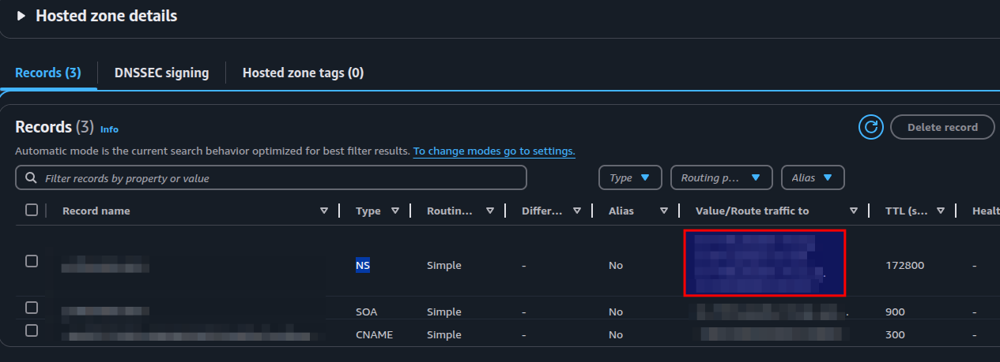
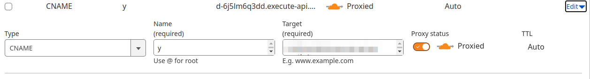

# AWS Example: CloudFlare + API Gateway (with custom domain) + Authorizer + Lambda backend

# Domain managed by AWS

Follow this if you want to manage your domain DNS in AWS Route 53.

> There is an extra 0.5 USD charge per month for each hosted zone in AWS Route 53.

## Create Route 53 hosted zone

- Go to AWS console *Route 53* / *Hosted zones*, click *Create hosted zone* to create a new hosted zone for your domain.
- Configure `NS` values on your domain manager, eg. CloudFlare, to use the values from `NS` records from Route 53:


- Now run `dig your.domain.name.com`, you should see AWS server appear in the console, eg,

``` bash
... awsdns-hostmaster.amazon.com. ...
```

## Create a new certificate on AWS

- Go to AWS console *Certificate Manager* / *Request a certificate*
- Select region `us-east-1` which is required for ACM certificate.
- Create a new certificate for your domain.

To validate the certificate, copy the CNAME setting from the certificate page and add to the DNS settings in Route 53. See screenshot above.


# Domain managed by CloudFlare

Follow this if you want to manage your domain DNS in CloudFlare.

## Create a new certificate on AWS and verify on CloudFlare

- Go to AWS console *Certificate Manager* / *Request a certificate*
- Select region same as the CDK stack
- Validate the certificate by adding the CNAME record to CloudFlare DNS settings.

Copy the ARN of the certficate and modify the CDK code.

## Update CNAME in CloudFlare

- After deploying the stack to AWS, get the API gateway regional domain name from the AWS cli, note that this is not the default API gateway domain name:

``` bash
❯ aws apigateway get-domain-names --region ap-south-1
```
- copy the value of `regionalDomainName` and add it to CloudFlare DNS settings as a new record of CNAME for the (sub)domain you intend to use.




# Test

Note:
- the `/prod/check` is mapped to `/check` in API Gateway.
- only `GET /check` is allowed in the current CDK App.

``` bash
❯ curl -H "Authorization: allow" https://<your-api-gateway-domain>/prod/check
❯ curl  -H "Authorization: allow" https://<your-domain>/check

# Both should return
{"message":"Hello from API"}
```
